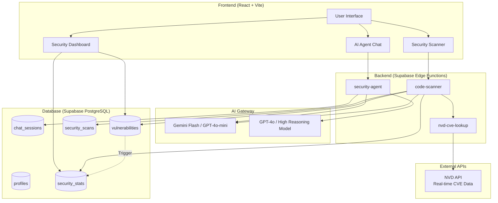

# AEGIS.ai - AI-Native Security Platform

<p align="center">
  <strong>Enterprise-grade security analysis powered by AI agents</strong>
</p>

---

## Table of Contents

1. [Overview](#overview)
2. [Architecture](#architecture)
3. [Features](#features)
4. [AI Agents](#ai-agents)
5. [Security Score System](#security-score-system)
6. [Security Scanner](#security-scanner)
7. [Database Schema](#database-schema)
8. [Authentication](#authentication)
9. [Technology Stack](#technology-stack)
10. [Getting Started](#getting-started)
11. [API Reference](#api-reference)
12. [Conclusion](#conclusion)

---

## Overview

AEGIS.ai is an AI-native security platform designed for secure, AI-accelerated development and code security analysis. It provides real-time threat detection, vulnerability tracking, and intelligent security assistance through specialized AI agents.

### Key Capabilities

- **Code Vulnerability Scanning**: Analyze code snippets for security issues
- **Dependency Auditing**: Check package.json files for vulnerable dependencies
- **LLM Protection (Prompt Shield)**: Detect prompt injection attacks and malicious inputs
- **AI-Powered Security Agents**: Four specialized agents for different security tasks
- **Real-time Dashboard**: Live vulnerability tracking and security scoring

---

## Architecture



### Data Flow

1. **User Scans Code** → `code-scanner` edge function
2. **AI Analysis** → AI Model identifies vulnerabilities
3. **NVD Enhancement** → Real CVE data fetched from National Vulnerability Database
4. **Database Update** → Vulnerabilities stored, triggers recalculate security score
5. **Dashboard Refresh** → Real-time updates via Supabase subscriptions

---

## Features

### Security Dashboard
- **Threats Detected**: Count of all detected vulnerabilities
- **Fixed**: Number of resolved vulnerabilities
- **Response Time**: Average scan response time in milliseconds
- **Security Score**: Dynamic score (0-100) based on vulnerability status

### Vulnerability Management
- Real-time vulnerability feed with status tracking
- Status workflow: Detected → Analyzing → Resolved/False Positive
- Notes and comments on each vulnerability
- Export reports as CSV or JSON

### Score Breakdown Panel
Visual breakdown showing:
- Base score calculation
- Unresolved vulnerabilities by severity
- Applied penalties
- Final score computation

---

## AI Agents

AEGIS.ai features **four specialized AI security agents**, each optimized for specific tasks:

### 1. SENTINEL Agent
**Purpose**: Quick security Q&A and single code snippet analysis

**Powered by**: Fast Reasoning Model (e.g., GPT-4o-mini)

**Best for**:
- Quick security questions ("What is SQL injection?")
- Single code snippet vulnerability checks
- Fast security guidance
- OWASP fundamentals

**Characteristics**:
- Fast response times
- Streaming output
- Conversational interface
- Good for iterative Q&A

**Example prompts**:
- "Explain XSS vulnerabilities"
- "Is this code vulnerable? `eval(userInput)`"
- "What are the OWASP Top 10?"

---

### 2. CODEX Agent
**Purpose**: Deep code audits and comprehensive multi-file reviews

**Powered by**: High Reasoning Model (e.g., GPT-4o)

**Best for**:
- Complete function/class security reviews
- Multi-line code analysis
- Detailed vulnerability explanations
- Remediation recommendations

**Characteristics**:
- Thorough analysis
- Detailed explanations
- Higher reasoning capability
- Best for complex code patterns

**Example prompts**:
- "Review this authentication function for vulnerabilities"
- "Audit this API endpoint for security issues"
- "Analyze this database query for injection risks"

---

### 3. AEGIS Agent
**Purpose**: Threat intelligence and security architecture guidance

**Powered by**: High Reasoning Model (e.g., GPT-4o)

**Best for**:
- Security architecture decisions
- Threat modeling
- Compliance guidance
- Security best practices

**Characteristics**:
- Strategic security advice
- Architecture-level thinking
- Policy recommendations

---

### 4. ASSIST Agent
**Purpose**: General security assistance and learning

**Powered by**: Fast Reasoning Model (e.g., GPT-4o-mini)

**Best for**:
- Security learning
- General questions
- Tool recommendations
- Quick help

**Characteristics**:
- Fast responses
- Beginner-friendly
- Broad topic coverage

---

### Important: AI Model Limitations

⚠️ **The AI models are NOT live-updated with real-time security data.**

| Aspect | Reality |
|--------|---------|
| **Training Data** | Models trained on data up to their cutoff date (typically months before release) |
| **CVE Database** | Does NOT have real-time CVE updates |
| **OWASP Updates** | Has OWASP knowledge from training, not live updates |
| **Zero-day Threats** | Cannot detect vulnerabilities discovered after training cutoff |
| **Threat Intelligence** | Based on training data, not live threat feeds |
### NVD Integration (Live CVE Data)

AEGIS.ai integrates with the **National Vulnerability Database (NVD)** to provide real-time CVE intelligence:

**How it works**:
1. When you run a code or dependency scan, the AI analyzer identifies vulnerability patterns
2. The scanner queries the NVD API for related CVEs published in the last 90 days
3. CVE data (ID, CVSS score, severity, CWE weaknesses) is matched to detected vulnerabilities
4. Additional relevant CVEs are added as "NVD Intelligence" findings

**What you get**:
- **Real CVE IDs**: Vulnerabilities are tagged with official CVE identifiers when matches are found
- **CVSS Scores**: Industry-standard vulnerability scoring from NIST
- **Related Alerts**: NVD alerts for patterns found in your code that match recent CVEs
- **Direct Links**: Each NVD finding links to the official NVD detail page

**Data Source**: https://services.nvd.nist.gov/rest/json/cves/2.0

**Rate Limiting**:
- Without API key: 5 requests per 30 seconds
- With API key: 50 requests per 30 seconds (optional, set `NVD_API_KEY` secret)

**Note**: NVD integration enhances scanner accuracy but the AI models themselves are not live-updated with CVE data. The NVD API provides the real-time intelligence layer.

---

## Security Score System

The Security Score is a **dynamic metric (0-100)** calculated automatically based on vulnerability data.

### Calculation Formula

```
Base Score = (Resolved Vulnerabilities / Total Vulnerabilities) × 100
           = 100 if no vulnerabilities exist

Severity Penalties (applied per unresolved vulnerability):
- Critical: -15 points
- High:     -10 points
- Medium:   -5 points
- Low:      -2 points

Final Score = MAX(0, MIN(100, Base Score - Total Penalties))
```

### Example Calculation

Given:
- Total vulnerabilities: 3
- Resolved: 1
- Unresolved: 2 high severity

Calculation:
```
Base Score = (1 / 3) × 100 = 33.33
Penalties  = 2 high × 10 = 20
Final      = 33.33 - 20 = 13 (rounded)
```

### Score Interpretation

| Score Range | Status | Meaning |
|-------------|--------|---------|
| 80-100 | 🟢 Good | Low risk, most issues resolved |
| 50-79 | 🟡 Warning | Moderate risk, action needed |
| 0-49 | 🔴 Critical | High risk, immediate action required |

### Automatic Updates

The score recalculates automatically via database triggers when:
- A new vulnerability is detected (INSERT)
- A vulnerability status changes (UPDATE)
- A vulnerability is removed (DELETE)

---

## Security Scanner

The scanner combines AI analysis with **real-time NVD CVE data** for enhanced accuracy.

### How AI Scanning Works

The security scanner uses an LLM (e.g., GPT-4o-mini) to analyze code. Here's exactly how it works:

#### Step-by-Step Scanning Process

```
┌─────────────────────────────────────────────────────────────────────────┐
│ 1. USER INPUT                                                           │
│    You paste code, dependencies, or a prompt into the scanner           │
└─────────────────────────────────────────────────────────────────────────┘
                                    │
                                    ▼
┌─────────────────────────────────────────────────────────────────────────┐
│ 2. EDGE FUNCTION (code-scanner)                                         │
│    - Receives your input                                                │
│    - Creates a scan record in the database                              │
│    - Builds a specialized security analysis prompt for the AI           │
└─────────────────────────────────────────────────────────────────────────┘
                                    │
                                    ▼
┌─────────────────────────────────────────────────────────────────────────┐
│ 3. AI MODEL ANALYSIS                                                    │
│    The AI receives a system prompt that says:                           │
│    "You are a security vulnerability scanner. Only respond with         │
│     valid JSON arrays. Be thorough and accurate."                       │
│                                                                         │
│    Then receives your code with instructions to check for:              │
│    - SQL Injection, XSS, Command Injection                              │
│    - Hardcoded Secrets, Path Traversal, CSRF                            │
│    - Insecure Deserialization, Broken Access Control                    │
│    - Prompt Injection (for LLM code), Data Exposure                     │
│                                                                         │
│    Returns a JSON array with each vulnerability containing:             │
│    - name, description, severity, category                              │
│    - location (line/snippet), remediation steps                         │
│    - auto_fix (corrected code), cve_id, cvss_score                      │
└─────────────────────────────────────────────────────────────────────────┘
                                    │
                                    ▼
┌─────────────────────────────────────────────────────────────────────────┐
│ 4. NVD CVE ENRICHMENT (Real-Time Data)                                  │
│    - Extracts vulnerability keywords from AI findings                   │
│    - Queries NVD API for related CVEs from last 90 days                 │
│    - Matches CVEs to findings using CWE weaknesses                      │
│    - Adds real CVE IDs, CVSS scores, severity ratings                   │
│    - Includes unmatched CVEs as "NVD Intelligence" alerts               │
└─────────────────────────────────────────────────────────────────────────┘
                                    │
                                    ▼
┌─────────────────────────────────────────────────────────────────────────┐
│ 5. DATABASE STORAGE                                                     │
│    - All vulnerabilities saved to `vulnerabilities` table               │
│    - Scan record updated in `security_scans` table                      │
│    - Stats updated in `security_stats` table                            │
│    - Database trigger recalculates security score                       │
└─────────────────────────────────────────────────────────────────────────┘
                                    │
                                    ▼
┌─────────────────────────────────────────────────────────────────────────┐
│ 6. REAL-TIME UI UPDATE                                                  │
│    - Supabase realtime subscription detects changes                     │
│    - Dashboard updates vulnerability feed                               │
│    - Security score and stats refresh automatically                     │
└─────────────────────────────────────────────────────────────────────────┘
```

#### What The AI Actually "Knows"

| Knowledge Type | Source | Limitation |
|----------------|--------|------------|
| Vulnerability patterns | Training data (static) | Not updated after training cutoff |
| OWASP Top 10 | Training data | May not have latest version |
| Common CVEs | Training data | No real-time CVE database |
| Secure coding practices | Training data | Based on pre-training best practices |
| Attack vectors | Training data | May miss newest techniques |

**This is why NVD integration is critical** - it provides the real-time CVE data that the AI model lacks.

### Dashboard Reset

The **Reset** button clears all security data:
- Deletes all vulnerabilities from the database
- Removes all scan history
- Resets all security stats to defaults (score back to 100)
- Clears the vulnerability feed in real-time

This allows you to start fresh with a clean dashboard.

---

### Scanner Types

#### 1. Code Scanner
Analyzes code snippets for vulnerabilities.

**AI Detection**:
- SQL Injection
- Cross-Site Scripting (XSS)
- Command Injection
- Path Traversal
- Insecure Deserialization
- Hardcoded Secrets
- Weak Cryptography

**NVD Enhancement**: Detected patterns are cross-referenced with recent CVEs (last 90 days).

**Usage**: Paste code into the scanner with "Code" tab selected.

#### 2. Dependency Scanner
Analyzes package.json or dependency lists.

**AI Detection**:
- Known vulnerable packages
- Outdated dependencies
- Deprecated packages
- License issues

**NVD Enhancement**: Package vulnerability patterns trigger NVD lookups for relevant CVEs.

**Usage**: Paste package.json content with "Dependencies" tab selected.

#### 3. LLM Shield (Prompt Protection)
Detects prompt injection and malicious inputs.

**Detects**:
- Prompt injection attempts
- Jailbreak patterns
- Role manipulation
- Instruction override attempts
- Data exfiltration attempts

**NVD**: No NVD integration (prompt injection lacks established CVE patterns).

**Usage**: Paste prompts/inputs with "LLM Shield" tab selected.

---

## Database Schema

### Tables

#### `vulnerabilities`
Stores all detected security issues.

| Column | Type | Description |
|--------|------|-------------|
| id | UUID | Primary key |
| name | TEXT | Vulnerability name |
| description | TEXT | Detailed description |
| severity | TEXT | critical, high, medium, low, info |
| category | TEXT | Vulnerability category (XSS, SQLi, etc.) |
| status | TEXT | detected, analyzing, resolved, false_positive |
| location | TEXT | Where the vulnerability was found |
| remediation | TEXT | How to fix it |
| cve_id | TEXT | CVE identifier if applicable |
| cvss_score | NUMERIC | CVSS score if applicable |
| notes | TEXT | User notes/comments |
| scan_id | UUID | Reference to the scan that found it |
| created_at | TIMESTAMP | When detected |
| resolved_at | TIMESTAMP | When resolved |

#### `security_stats`
Stores dashboard metrics.

| Column | Type | Description |
|--------|------|-------------|
| id | UUID | Primary key |
| metric_name | TEXT | threats_blocked, vulnerabilities_fixed, avg_response_time_ms, security_score |
| metric_value | NUMERIC | Current value |
| previous_value | NUMERIC | Previous value (for % change) |
| updated_at | TIMESTAMP | Last update time |

#### `security_scans`
Stores scan history.

| Column | Type | Description |
|--------|------|-------------|
| id | UUID | Primary key |
| scan_type | TEXT | code, dependency, llm_protection |
| target | TEXT | What was scanned |
| status | TEXT | pending, running, completed, failed |
| metadata | JSONB | Additional scan data |
| created_at | TIMESTAMP | Scan start time |
| completed_at | TIMESTAMP | Scan end time |

#### `chat_sessions`
Stores agent conversation history.

| Column | Type | Description |
|--------|------|-------------|
| id | UUID | Primary key |
| user_id | UUID | Owner of the session |
| agent_mode | TEXT | sentinel, codex, aegis, assist |
| messages | JSONB | Full conversation history |
| preview | TEXT | Last message preview |
| created_at | TIMESTAMP | Session creation time |
| updated_at | TIMESTAMP | Last activity |

#### `profiles`
Stores user profile data.

| Column | Type | Description |
|--------|------|-------------|
| id | UUID | Primary key |
| user_id | UUID | Auth user reference |
| email | TEXT | User email |
| display_name | TEXT | Display name |
| avatar_url | TEXT | Profile image URL |

### Database Functions

#### `recalculate_security_score()`
Automatically recalculates the security score based on current vulnerability data.

Triggered by:
- INSERT on vulnerabilities
- UPDATE on vulnerabilities  
- DELETE on vulnerabilities

---

## Authentication

### Authentication Flow

1. **Sign Up**: Email/password registration
2. **Email Confirmation**: Auto-confirmed (no email verification required in development)
3. **Sign In**: Email/password login
4. **Session**: JWT-based session management via Supabase Auth

### Protected Routes

- `/dashboard` - Requires authentication
- `/agent` - Requires authentication
- All agent features require login

### Profile Creation

User profiles are automatically created on signup via database trigger (`handle_new_user`).

---

## Technology Stack

### Frontend
| Technology | Purpose |
|------------|---------|
| React 18 | UI framework |
| TypeScript | Type safety |
| Vite | Build tool |
| Tailwind CSS | Styling |
| shadcn/ui | Component library |
| React Router | Navigation |
| TanStack Query | Data fetching |
| Recharts | Charts/visualization |

### Backend
| Technology | Purpose |
|------------|---------|
| Supabase | Backend-as-a-Service |
| PostgreSQL | Database |
| Edge Functions (Deno) | Serverless functions |
| Row Level Security | Data protection |

### AI Integration
| Model | Provider | Used By |
|-------|----------|---------|
| gpt-4o-mini | OpenAI | SENTINEL, ASSIST agents |
| gpt-4o | OpenAI | CODEX, AEGIS agents |

---

## Getting Started

### Prerequisites
- Node.js 18+
- npm or bun
- Supabase CLI (`npm install -g supabase`)
- An OpenAI API Key (or compatible provider)

### Installation & Local Setup

1. **Clone the repository**
   ```bash
   git clone <repository-url>
   cd <project-directory>
   ```

2. **Install dependencies**
   ```bash
   npm install
   ```

3. **Environment Setup**
   Copy the example environment file:
   ```bash
   cp .env.example .env
   ```

   Open `.env` and fill in your Supabase credentials. If you are running Supabase locally (next step), you will get these credentials after starting Supabase.

   Also provide your `AI_API_KEY` (e.g., your OpenAI API Key).

4. **Start Supabase Locally**
   Make sure you have Docker running, then:
   ```bash
   supabase start
   ```
   This will spin up a local Supabase instance including the database, auth, and edge functions support.

   After it starts, it will output your `API URL` and `anon key`. Copy these to your `.env` file as `VITE_SUPABASE_URL` and `VITE_SUPABASE_PUBLISHABLE_KEY`.

   Also grab the `service_role key` for the edge functions environment in Supabase.

5. **Deploy Database Migrations**
   Initialize the database schema:
   ```bash
   supabase db push
   # OR if you have migration files
   supabase migration up
   ```

6. **Deploy Edge Functions**
   Serve the edge functions locally:
   ```bash
   supabase functions serve --env-file .env
   ```
   Or deploy them to your remote Supabase project:
   ```bash
   supabase functions deploy --env-file .env
   ```

7. **Start the Frontend**
   ```bash
   npm run dev
   ```

   Open http://localhost:8080 to view the app.

---

## API Reference

### Edge Functions

#### `POST /functions/v1/code-scanner`
Scans code, dependencies, or prompts for security issues.

**Request Body**:
```json
{
  "scanType": "code" | "dependency" | "llm_protection",
  "code": "string (for code scans)",
  "dependencies": "string (for dependency scans)",
  "prompt": "string (for LLM protection scans)"
}
```

#### `POST /functions/v1/nvd-cve-lookup`
Direct CVE lookup from National Vulnerability Database.

#### `POST /functions/v1/security-agent`
Streams AI agent responses.

**Request Body**:
```json
{
  "messages": [
    { "role": "user", "content": "..." }
  ],
  "agentMode": "sentinel" | "codex" | "aegis" | "assist"
}
```

---

## Conclusion

AEGIS.ai represents the next generation of developer security tools, shifting from static analysis to intelligent, AI-native protection. By combining the reasoning capabilities of modern LLMs with the real-time data of the National Vulnerability Database, it offers a robust defense against both traditional software vulnerabilities and emerging AI-specific threats.

Whether used for quick code checks, deep architectural reviews, or educational purposes, AEGIS.ai empowers developers to ship secure code faster and with greater confidence. The modular architecture and open database schema allow for easy extension and integration into existing workflows, making it a versatile platform for teams of any size.

---

## License

MIT License - See LICENSE file for details.
